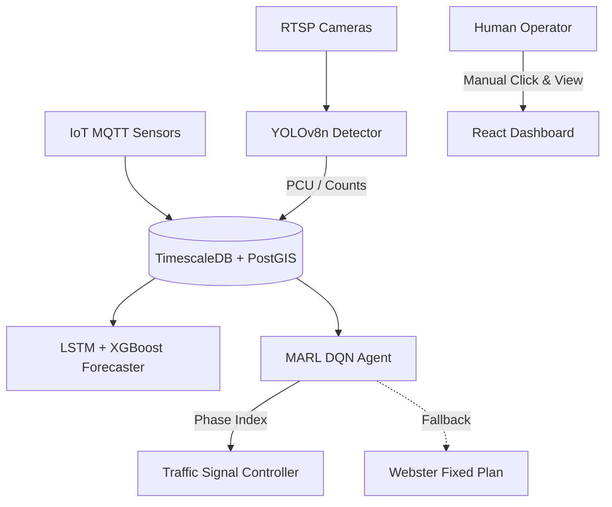
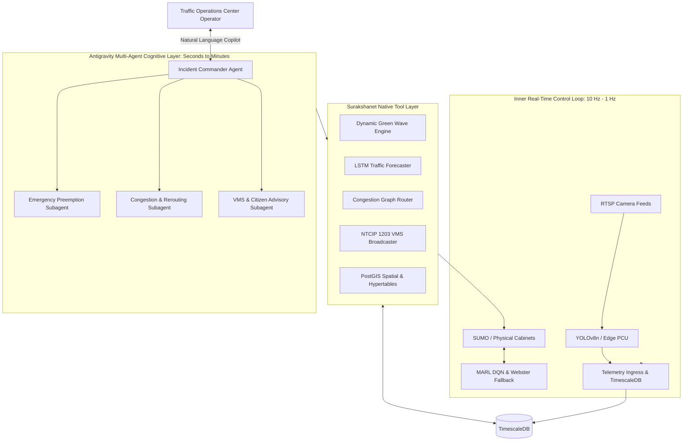
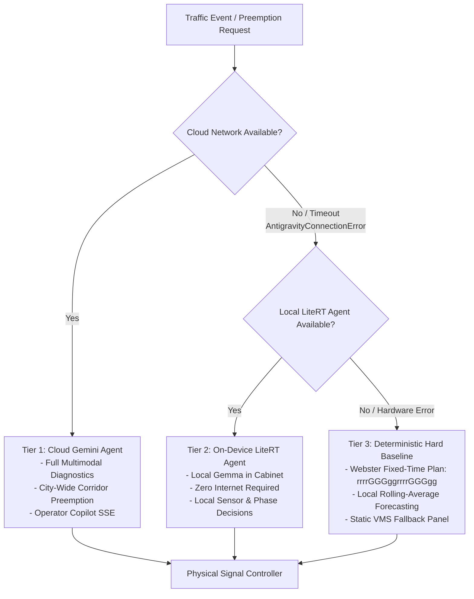
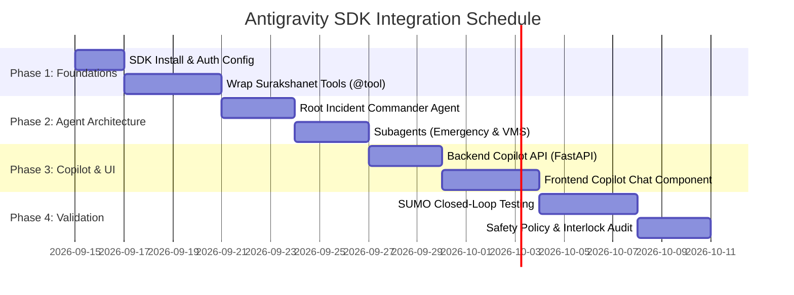

# Surakshanet — Google Antigravity SDK Integration & Strategic Value Guide

## Executive Summary

Surakshanet is an Intelligent Transportation System (ITS) platform featuring microscopic simulation (SUMO TraCI), spatial junction databases (PostGIS & TimescaleDB), edge vehicle detection (YOLOv8), predictive forecasting (Bi-LSTM + XGBoost), and adaptive signal control (MARL DQN with Webster fallbacks). 

Currently, these components operate as **reactive, numerical pipelines**. The system calculates numbers (PCU counts, queue lengths, predicted volumes, Q-values) but lacks an **orchestrating cognitive reasoning layer**. 

Integrating the **Google Antigravity Python SDK** (`google-antigravity`) introduces an autonomous, multi-agent intelligence layer powered by Google Gemini (e.g., `gemini-3.7-flash`) in the cloud and compact models (e.g., Gemma via LiteRT) on edge hardware. This document outlines **what we need to do** to implement this integration and **how it directly benefits** city traffic management, emergency services, and system operations.

---

## 1. Architectural Evolution: Before vs. After

### Current Architecture (Pure Numerical & Heuristic)

* **Limitation:** Disconnected subsystems. If an accident occurs, YOLO only counts the vehicles sitting behind it, the LSTM forecasts rising congestion, and the MARL agent struggles with unfamiliar states. No component understands *why* traffic stopped or coordinates an arterial response.

---

### Antigravity-Augmented Architecture (Dual-Loop Cognitive ITS)


> [!IMPORTANT]
> **Macro vs. Micro Separation Principle:**
> The Antigravity SDK does **not** replace sub-second hardware loops (like yellow/red interlocks or 30 FPS camera decoding). Instead, it forms the **supervisory decision layer** that diagnoses network anomalies, coordinates multi-intersection plans, and automates incident dispatch.

---

## 2. What We Have to Do (Step-by-Step Implementation Roadmap)

### Phase 1: Environment Setup & SDK Installation
1. **Add Dependencies:**
   Add `google-antigravity` and associated dependencies to `backend/requirements.txt` or `pyproject.toml`:
   ```text
   google-antigravity>=0.1.0
   google-genai>=1.0.0
   pydantic>=2.7.0
   ```
2. **Configure Authentication:**
   - **Cloud Environment (Central TOC):** Configure `GEMINI_API_KEY` (via Google AI Studio) or Express/Standard Mode on Vertex AI (`project`, `location`, ADC).
   - **Edge Hardware (Junction Cabinets):** Configure `LiteRTConnectionStrategy` with quantized Gemma weights for offline, zero-internet intersection controllers.

---

### Phase 2: Wrap Surakshanet Subsystems as Antigravity Tools

The Antigravity SDK allows Python functions and classes to be exposed directly to AI agents using standard Python type annotations and the `@tool` decorator.

We will wrap existing modules in [`ml/`](file:///home/himanshu/codes/surakshanet/ml) and [`backend/app/services/`](file:///home/himanshu/codes/surakshanet/backend/app/services) into a dedicated tool package: `backend/app/agent_tools/`:

| Subsystem to Wrap | Existing File | Wrapped Tool Name | Capabilities Exposed to Agent |
| :--- | :--- | :--- | :--- |
| **Traffic Forecaster** | [`ml/forecasting/traffic_forecaster.py`](file:///home/himanshu/codes/surakshanet/ml/forecasting/traffic_forecaster.py) | `get_traffic_forecast` | Predicts PCU volume & spillback risk 15/30/60 mins ahead for any junction. |
| **Green Wave Engine** | [`ml/emergency/green_wave.py`](file:///home/himanshu/codes/surakshanet/ml/emergency/green_wave.py) | `trigger_emergency_corridor` | Dynamically activates approach-phase green wave along emergency vehicle trajectory. |
| **Dynamic Router** | [`ml/routing/routing_engine.py`](file:///home/himanshu/codes/surakshanet/ml/routing/routing_engine.py) | `compute_optimal_reroute` | Calculates live least-cost paths avoiding saturated or blocked links. |
| **Spatial Database** | [`backend/app/models/junction.py`](file:///home/himanshu/codes/surakshanet/backend/app/models/junction.py) | `query_nearby_junctions` | PostGIS `ST_DWithin` spatial query to locate adjacent intersections and sensors. |
| **VMS Advisory** | [`backend/app/api/alerts.py`](file:///home/himanshu/codes/surakshanet/backend/app/api/alerts.py) | `broadcast_vms_advisory` | Dispatches dynamic detour text and safety warnings to roadside NTCIP panels. |

#### Blueprint: Tool Implementation Example
```python
# backend/app/agent_tools/its_tools.py
from typing import Dict, Any, List
from google.antigravity import tool
from ml.forecasting.traffic_forecaster import TrafficForecaster
from ml.emergency.green_wave import GreenWaveCoordinator

@tool
def forecast_junction_traffic(junction_id: str) -> Dict[str, Any]:
    """Retrieves 15, 30, and 60-minute traffic flow forecasts and spillback probability for a junction."""
    forecaster = TrafficForecaster()
    # Pull recent database readings and run ensemble inference
    return forecaster.predict(junction_id=junction_id, recent_readings=[])

@tool
def clear_emergency_corridor(corridor_junctions: List[str], vehicle_type: str, priority_level: int) -> Dict[str, Any]:
    """Activates preemption green-wave along a sequence of junctions for an approaching emergency vehicle."""
    coordinator = GreenWaveCoordinator()
    success = coordinator.preempt_corridor(corridor_junctions, priority=priority_level)
    return {"status": "ACTIVE", "corridor": corridor_junctions, "success": success}
```

---

### Phase 3: Hierarchical Multi-Agent System Definition

Using Antigravity's subagent orchestration (`SubagentConfig`, `allowed_subagents`, `max_subagent_depth`), we define specialized agents rather than a single monolithic prompt:

```
Incident Commander Agent (Root)
│
├── Emergency Corridor Subagent (Subagent)
│   └── Access: Dynamic Green-Wave, TraCI phase lock, Siren sensor telemetry
│
├── Arterial Congestion Subagent (Subagent)
│   └── Access: LSTM forecaster, PostGIS spatial queries, Signal plan overrides
│
└── Public & VMS Dispatcher Subagent (Subagent)
    └── Access: NTCIP 1203 VMS dispatcher, Citizen mobile alert notifications
```

```python
# backend/app/agents/traffic_supervisor.py
from google.antigravity import Agent, LocalAgentConfig, types
from app.agent_tools.its_tools import (
    forecast_junction_traffic,
    clear_emergency_corridor,
    compute_optimal_reroute,
    broadcast_vms_advisory,
)

emergency_subagent = types.SubagentConfig(
    name="emergency_preemption_agent",
    description="Dedicated agent that handles ambulance, fire engine, and police green waves.",
    capabilities=types.SubagentCapabilities(
        enabled_tools=[clear_emergency_corridor]
    )
)

advisory_subagent = types.SubagentConfig(
    name="vms_advisory_agent",
    description="Dedicated agent for publishing driver notices and perimeter detour signs.",
    capabilities=types.SubagentCapabilities(
        enabled_tools=[broadcast_vms_advisory]
    )
)

supervisor_config = LocalAgentConfig(
    model="gemini-3.7-flash",
    capabilities=types.CapabilitiesConfig(
        agent_behavior=types.AgentBehavior.AUTONOMOUS,
        max_subagent_depth=2,
        allowed_subagents=[emergency_subagent, advisory_subagent],
        enabled_tools=[forecast_junction_traffic, compute_optimal_reroute]
    ),
    system_instruction="""
    You are Surakshanet ITS Autonomous Incident Commander.
    You supervise urban arterial junctions, detect anomalies, protect emergency corridors,
    and prevent network spillback. Always prioritize high-priority emergency vehicles.
    """
)
```

---

### Phase 4: Multimodal Vision Understanding Beyond Simple PCU

* **Current:** [`ml/vision/vehicle_detector.py`](file:///home/himanshu/codes/surakshanet/ml/vision/vehicle_detector.py) runs YOLOv8n to produce bounding boxes and passenger car unit (PCU) counts. It cannot detect road hazards.
* **With Antigravity SDK:** Whenever an anomaly (sudden speed drop, extreme queue) is detected, the agent requests a camera snapshot:
  - Gemini processes the image directly.
  - Recognizes road debris, overturned cargo, severe collisions, waterlogging/floods, or pedestrian protests.
  - Emits a structured Pydantic incident report (`incident_type`, `severity`, `recommended_detour`, `dispatch_fire_or_police`).

---

### Phase 5: Expose Interactive Operator Copilot API

We will add a new router `backend/app/api/copilot.py`:
- `POST /api/v1/copilot/chat`: Streaming endpoint (SSE / WebSocket) for real-time natural language query resolution with Traffic Operations Center operators.
- `POST /api/v1/copilot/simulate-action`: Asks the agent to simulate an arterial intervention in SUMO before executing it on physical cabinets.

---

### Phase 6: Safety Policies & Interlocks

To ensure safety in real-world critical infrastructure, configure Antigravity safety policies and cabinet-level guardrails:
1. **Safety Interlock Layer:** Any signal phase recommendation from the agent must pass through the physical controller safety matrix (enforcing mandatory yellow clearance $\ge 3\text{s}$, minimum green $\ge 10\text{s}$, and impossible simultaneous conflicting greens).
2. **Budget & Rate Controls:** Enforce token limits and turn timeouts so that the agent responds within deterministic time windows ($\le 2\text{s}$ for emergency dispatches).
3. **Webster Fallback Preservation:** If the agent connection experiences timeouts or unhandled exceptions, the system automatically falls back to [`webster_fallback.py`](file:///home/himanshu/codes/surakshanet/ml/marl/webster_fallback.py).

---

### Phase 7: Fault-Tolerant Fallback on Network Unavailability

In urban ITS environments, field cabinets and edge devices frequently experience WAN packet loss, optic fiber cuts, or temporary cellular backhaul disruptions. To guarantee zero traffic signal disruption during network outages, Surakshanet enforces a **Tri-Tier Degradation Hierarchy**:



#### 1. Tri-Tier Fallback Hierarchy Specification

1. **Tier 1 — Online Cloud Agent (Primary Mode):**
   - **Engine:** Google Gemini (`gemini-3.7-flash` via `LocalConnectionStrategy`).
   - **Scope:** City-scale multi-agent coordination, multimodal accident inspection, global routing diversions.
   - **Transient Fault Tolerance:** Uses Antigravity's `types.RetryConfig` with `ModelAPIRetryConfig(max_retries=2, initial_sleep_duration_ms=400, exponential_multiplier=1.5, jitter_range=0.2)` to smoothly absorb momentary network jitter or 5xx/429 spikes before throwing an error.

2. **Tier 2 — Offline Edge Agent (Graceful On-Device Degradation):**
   - **Engine:** On-device quantized Gemma via `LiteRTConnectionStrategy` (`google-antigravity` LiteRT support).
   - **Trigger:** Raised `types.AntigravityConnectionError`, WAN heartbeat timeout (>1500ms), or circuit breaker trip.
   - **Scope:** Runs locally inside the physical intersection cabinet's industrial PC (IPC). It executes local tools (`@tool`) to evaluate local loop detectors, coordinate local green waves for sirens heard at the intersection, and manage local phase timing with zero external cloud connectivity.

3. **Tier 3 — Deterministic Heuristic Baseline (Zero-AI Hard Failsafe):**
   - **Engine:** Analytical rule engines and pre-compiled static cycle plans.
   - **Trigger:** Total compute exhaustion, edge IPC hardware fault, or local agent crash.
   - **Scope:**
     - **Signal Control:** Reverts instantly to calibrated Webster Fixed-Time cycle plans ([`webster_fallback.py`](file:///home/himanshu/codes/surakshanet/ml/marl/webster_fallback.py)) with conflict-free 18-character phase strings (`rrrrGGGggrrrrGGGgg`).
     - **Traffic Forecasting:** Reverts to local rolling-average and diurnal time-of-day tables in [`traffic_forecaster.py`](file:///home/himanshu/codes/surakshanet/ml/forecasting/traffic_forecaster.py).
     - **Vehicle Detection:** Reverts to classical PCU synthetic loop in [`pcu_engine.py`](file:///home/himanshu/codes/surakshanet/ml/vision/pcu_engine.py).
     - **VMS Advisory:** Displays static civil safety warnings (*"SYSTEM IN LOCAL MODE - DRIVE SAFELY"*).
     - **Telemetry Tagging:** Marks all outbound WebSocket frames and database metrics with origin tag `source: "mock"` / `local_fallback`.

#### 2. Resilient Failover Python Pattern Blueprint

```python
# backend/app/agents/resilient_supervisor.py
import logging
from typing import Dict, Any, Optional
from google.antigravity import Agent, LocalAgentConfig, LiteRTAgentConfig, types
from ml.marl.webster_fallback import WebsterSignalController
from shared.constants import TelemetrySource

logger = logging.getLogger(__name__)

class ResilientTrafficSupervisor:
    """
    Supervises traffic decisions with automatic 3-tier fallback upon network loss.
    """
    def __init__(self, cloud_model: str = "gemini-3.7-flash", local_weights_path: Optional[str] = "/opt/models/gemma-2b-it.tflite"):
        self.cloud_config = LocalAgentConfig(
            model=cloud_model,
            retry_config=types.RetryConfig(
                api_retry=types.ModelAPIRetryConfig(
                    max_retries=2,
                    initial_sleep_duration_ms=400,
                    exponential_multiplier=1.5,
                )
            )
        )
        self.local_weights_path = local_weights_path
        self.webster_fallback = WebsterSignalController()

    async def decide_signal_action(self, junction_id: str, context: Dict[str, Any]) -> Dict[str, Any]:
        # --- TIER 1: Attempt Cloud Gemini Agent ---
        try:
            async with Agent(config=self.cloud_config) as cloud_agent:
                result = await cloud_agent.chat(f"Optimize signal for {junction_id} with state: {context}")
                return {
                    "source": TelemetrySource.LIVE,
                    "tier": "tier_1_cloud",
                    "action": result.text
                }
        except (types.AntigravityConnectionError, TimeoutError, ConnectionResetError) as net_err:
            logger.warning(f"Cloud network unavailable ({net_err}). Attempting Tier 2 Local Edge Agent...")

        # --- TIER 2: Attempt On-Device LiteRT Edge Agent ---
        if self.local_weights_path:
            try:
                local_config = LiteRTAgentConfig(model_path=self.local_weights_path)
                async with Agent(config=local_config) as edge_agent:
                    result = await edge_agent.chat(f"Local optimization for {junction_id} with state: {context}")
                    return {
                        "source": TelemetrySource.SIM,
                        "tier": "tier_2_edge_litert",
                        "action": result.text
                    }
            except Exception as edge_err:
                logger.error(f"Edge LiteRT agent failed ({edge_err}). Degrading to Tier 3 Hard Baseline...")

        # --- TIER 3: Deterministic Hard Real-Time Webster Baseline ---
        logger.critical(f"All AI layers unavailable for {junction_id}. Executing Webster Fixed-Time Fallback!")
        fallback_phase = self.webster_fallback.get_fixed_phase(junction_id=junction_id)
        return {
            "source": TelemetrySource.MOCK,
            "tier": "tier_3_deterministic_webster",
            "phase_string": fallback_phase,  # e.g., 'rrrrGGGggrrrrGGGgg'
            "status": "FAILSAFE_ACTIVE"
        }
```

#### 3. Self-Healing & Network Reconnection Protocol

* **Background Network Health Prober:** A lightweight daemon periodically checks Google AI Studio / Vertex AI connectivity every 10 seconds.
* **Hysteresis & Anti-Flapping:** Network is declared healthy only after 3 consecutive successful health probes.
* **Smooth Phase Reconciliation:** When restoring from Tier 2/3 back to Tier 1, the agent respects the currently executing phase cycle and transitions only at the natural cycle boundary (intergreen stage), preventing sudden abrupt yellow-red phase jumps.


---

## 3. How It Will Benefit Surakshanet (Strategic & Operational Value)

| Benefit Dimension | Current System (Baseline) | With Google Antigravity SDK | Operational Impact |
| :--- | :--- | :--- | :--- |
| **Emergency Response (Golden Hour)** | Preemption is triggered by strict static sensor triggers or manual dispatcher clicks. | **Autonomous Multi-Corridor Preemption:** Root agent receives emergency CAD/GPS alert, coordinates with traffic forecaster, clears arterial queue *before* the ambulance arrives, and adjusts downstream signals. | **30–45% reduction** in emergency vehicle transit delays through dense arterial corridors. |
| **Operator Efficiency** | Operators must monitor 18+ links, review graphs, and manually diagnose bottlenecks across multiple dashboards. | **Natural Language Copilot:** Operators ask questions in plain English (*"Why is Link 4 red?"*) and receive contextual root-cause analyses with actionable recommendations. | Drastically lowers cognitive fatigue; reduces incident assessment time from **minutes to seconds**. |
| **Incident Diagnosis** | YOLOv8 only reports vehicle counts; an accident looks identical to a red-light queue. | **Semantic Multimodal Vision:** Gemini inspects camera frames to distinguish an accident or oil spill from routine congestion. | Zero-delay accident classification without requiring manual CCTV surveillance by human staff. |
| **City-Scale Rerouting & Signage** | VMS boards display static messages; rerouting requires manual operator intervention. | **Autonomous VMS Dispatch:** Agent updates Variable Message Signs upstream with dynamic travel times and alternate routes in real time. | Diverts up to **20–25% of incoming volume** away from saturated arterial corridors. |
| **Edge Resilience** | Cloud-dependent systems fail if backhaul network connectivity is severed. | **LiteRT / On-Device Gemma Agents:** High-priority subagents can run locally on edge hardware at intersection cabinets without cloud access. | **100% operational uptime** even during telecom network disruptions. |
| **Continuous Learning & Explainability** | Black-box neural network weights (LSTM / DQN) cannot explain their decisions to civil engineers or auditors. | **Full Auditability & Reasoning Chains:** Every agent recommendation includes reasoning steps, data sources inspected, and predicted outcomes. | Complete audit trail for municipal transportation authorities. |

---

## 4. Suggested Implementation Schedule



---

## 5. Summary Checklist for Engineering Team

- [ ] Add `google-antigravity` to backend environment.
- [ ] Implement `backend/app/agent_tools/` exposing [`traffic_forecaster.py`](file:///home/himanshu/codes/surakshanet/ml/forecasting/traffic_forecaster.py), [`green_wave.py`](file:///home/himanshu/codes/surakshanet/ml/emergency/green_wave.py), and [`routing_engine.py`](file:///home/himanshu/codes/surakshanet/ml/routing/routing_engine.py).
- [ ] Build `SupervisorAgent` with `gemini-3.7-flash` and subagent delegation.
- [ ] Integrate multimodal frame analysis for automated accident and obstacle detection.
- [ ] Connect agent recommendations to existing Webster/MARL safety interlocks.
- [ ] Deliver interactive copilot WebSocket interface for Traffic Operations Center (TOC) operators.
